# How to Install and Configure SSH on Ubuntu 22.04

**NAMA : RAISYAH MEPA ANGELA
NIIM : 09011282328033
KELAS : SK3C
MATA KULIAH : PRAKTIKUM SISTEM OPERASI**

**How to Install and Configure SSH on Ubuntu 22.04**

**Step 1: Prepare Ubuntu**

sudo apt update && sudo apt upgrade

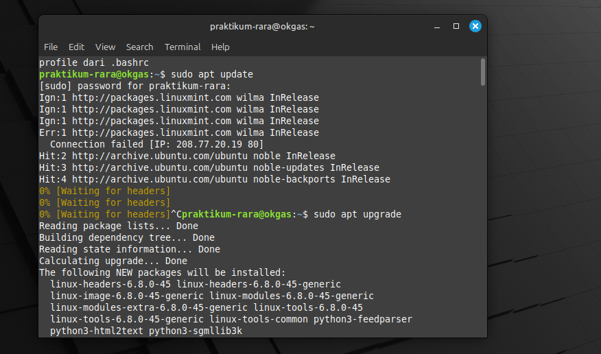

**Step 2: Install SSH on Ubuntu**

sudo apt install openssh-server

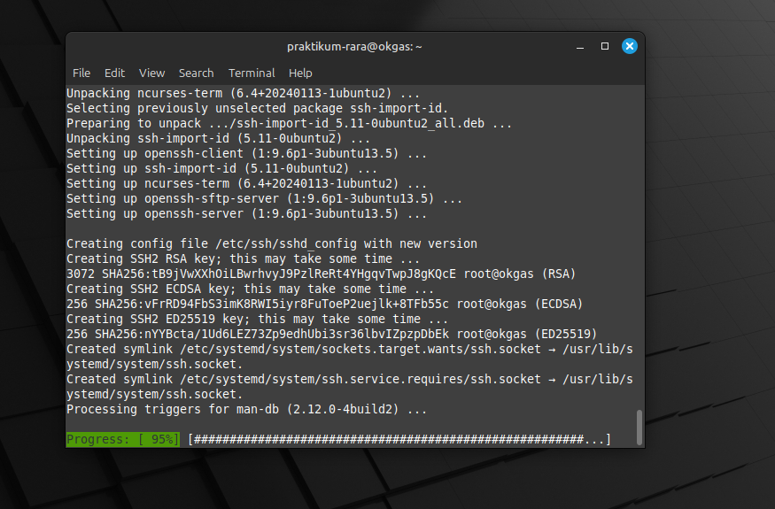

**Step 3: Start SSH**

Now you need to enable the service you just installed using the command below:

**sudo systemctl enable --now ssh**

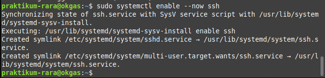

To verify that the service is enabled and running successfully, type:

**sudo systemctl status ssh**

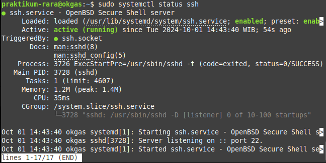

If you want to disable the service, execute: 

**sudo systemctl disable ssh**

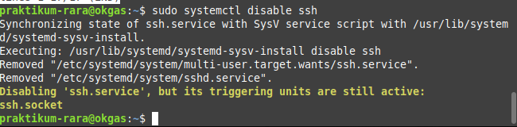

**Step 4: Configure the firewall**

Before connecting to the server via SSH, check the firewall to ensure it is configured correctly.
In our case, we have the UFW installed, so we will use the following command:

**sudo ufw status**

**Step 5: Connect to the server**

Once you complete all the previous steps, you can log into the server using the SSH protocol.
To do this, you will need the server's IP address or domain name and the name of a user created on the server.
In the terminal line, enter the command:

**ssh username@IP_address**

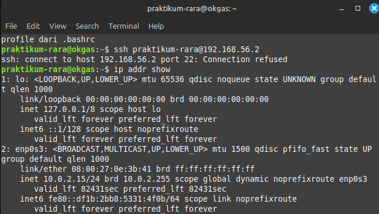

Selanjutnya, masuk ke view network connection, pilih Ethernet, klik properties, ke internet protocol version 4 lalu buka propertiesnya dan atur IP_Address nya.

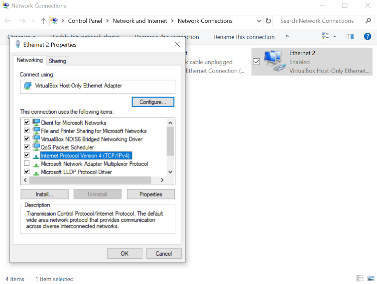

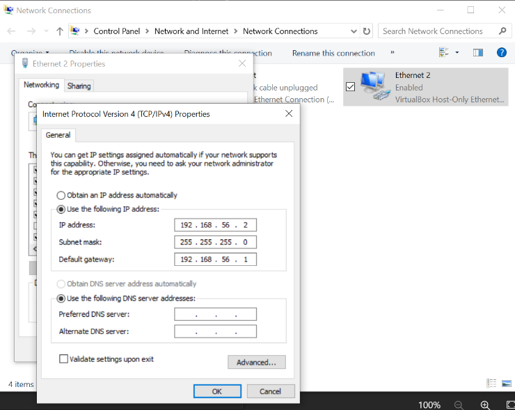

Lalu, kita bisa beralih ke command prompt dan memastikan jaringan terhubung dengan cara mengeceknya.

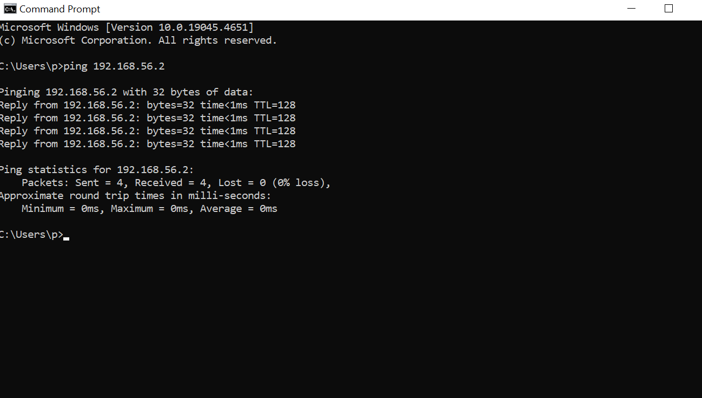

Selanjutnya adalah membuka Powershell dan memasukan perintah ssh -p 2222 username@IP_Address.

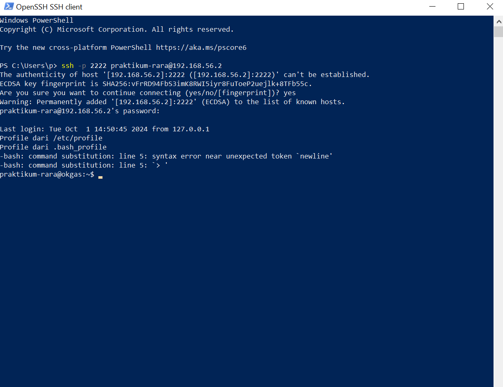

Terakhir, adalah memberi perintah ls untuk mengecek dan perinta neofetch untuk memastikan data yang ada didalamnya.

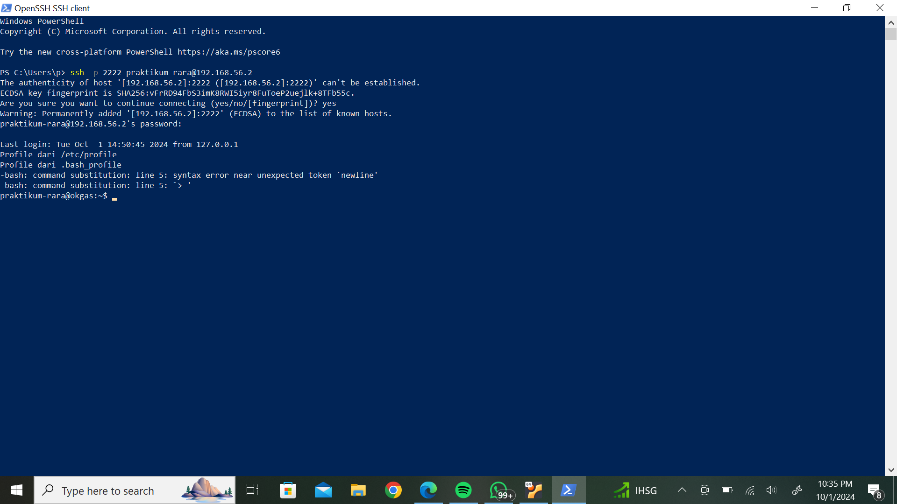

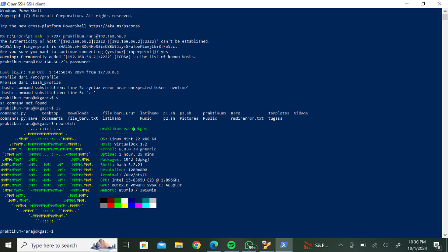
